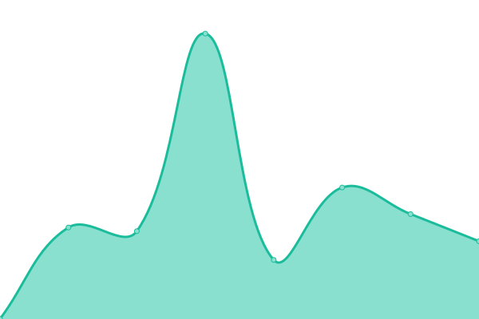

# [📈 Live Status](https://uptime.astralsight.space): <!--live status--> **所有系统均正常运行**

This repository contains the open-source uptime monitor and status page for [AstralSight Studios](astralsight.space), powered by [Upptime](https://github.com/upptime/upptime).

With [Upptime](https://upptime.js.org), you can get your own unlimited and free uptime monitor and status page, powered entirely by a GitHub repository. We use [Issues](https://github.com/AstralSightStudios/uptime-monitor/issues) as incident reports, [Actions](https://github.com/AstralSightStudios/uptime-monitor/actions) as uptime monitors, and [Pages](https://uptime.astralsight.space) for the status page.

<!--start: status pages-->
<!-- This summary is generated by Upptime (https://github.com/upptime/upptime) -->
<!-- Do not edit this manually, your changes will be overwritten -->
<!-- prettier-ignore -->
| URL | Status | History | Response Time | Uptime |
| --- | ------ | ------- | ------------- | ------ |
|  [AstralSight 统一登录平台](https://cas.astralsight.space) | 正常 | [astral-sight.yml](https://github.com/AstralSightStudios/uptime-monitor/commits/HEAD/history/astral-sight.yml) | 

 499毫秒
     
 | 

<a href="https://uptime.astralsight.space/history/astral-sight">100.00%</a>
    

|  [AFFiNE 文档协作平台](https://affine.astralsight.space) | 正常 | [af-fi-ne.yml](https://github.com/AstralSightStudios/uptime-monitor/commits/HEAD/history/af-fi-ne.yml) | 

 582毫秒
     
 | 

<a href="https://uptime.astralsight.space/history/af-fi-ne">100.00%</a>
    

|  [Plane 项目管理平台](https://pm.astralsight.space) | 正常 | [plane.yml](https://github.com/AstralSightStudios/uptime-monitor/commits/HEAD/history/plane.yml) | 

 521毫秒
     
 | 

<a href="https://uptime.astralsight.space/history/plane">100.00%</a>
    

|  [Weblate 翻译平台](https://weblate.astralsight.space) | 正常 | [weblate.yml](https://github.com/AstralSightStudios/uptime-monitor/commits/HEAD/history/weblate.yml) | 

 857毫秒
     
 | 

<a href="https://uptime.astralsight.space/history/weblate">100.00%</a>
    

<!--end: status pages-->

[**Visit our status website →**](https://uptime.astralsight.space)

## 📄 License

- Powered by: [Upptime](https://github.com/upptime/upptime)
- Code: [MIT](./LICENSE) © [Anand Chowdhary](https://anandchowdhary.com), supported by [Pabio](https://pabio.com)
- Data in the `./history` directory: [Open Database License](https://opendatacommons.org/licenses/odbl/1-0/)
